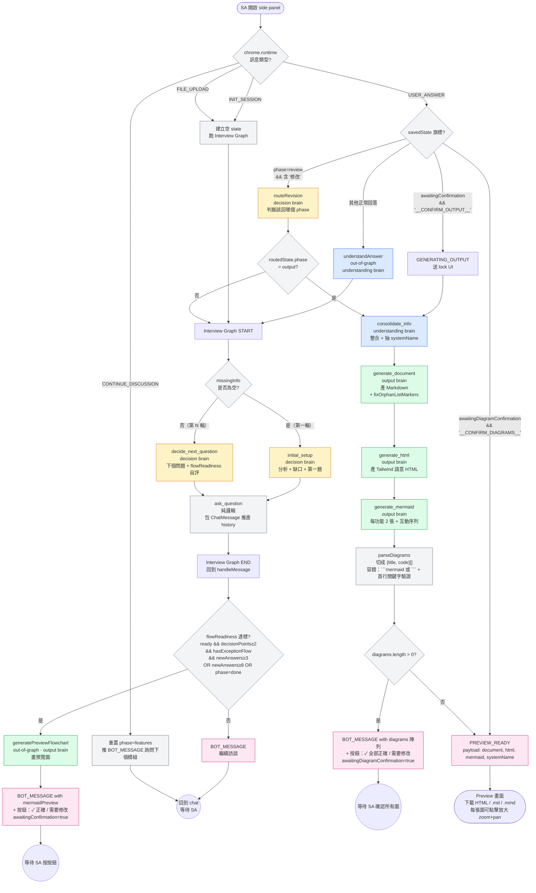

# SA Interview Bot — 架構流程圖

> 用於 architecture review。涵蓋 v1.14.3 的完整訊息流：訊息進 SW → 走 LangGraph → 出 BOT_MESSAGE / PREVIEW_READY。

## 系統節點清單

### A. Interview Graph（`buildInterviewGraph` in `src/service-worker/graph.ts:47`）
| Node | 檔案 | LLM brain |
|------|------|-----------|
| `initial_setup` | `nodes/initialSetup.ts` | decision（第一輪合併：分析資料 + 找缺口 + 第一題） |
| `decide_next_question` | `nodes/decideNextQuestion.ts` | decision（決定下題 + 自評 `flowReadiness`） |
| `ask_question` | `nodes/askQuestion.ts` | 無 LLM（純邏輯，包 ChatMessage 推進 history） |

### B. Out-of-graph 節點（在 `src/service-worker/index.ts:handleMessage` 直接呼叫）
| Node | 觸發 | LLM brain |
|------|------|-----------|
| `understandAnswer` | 每次 USER_ANSWER **進 interview graph 之前** | understanding（結構化回答 + 更新 phase / systemOverview / userRoles） |
| `generatePreviewFlowchart` | decision brain 自評 ready 且滿足門檻時，**取代正常 ask_question** | output（inline 預覽流程圖） |
| `routeRevision` | `phase=review` 期間 SA 訊息含「修改」 | decision（判斷該回哪個 phase 重來） |

### C. Output Graph（`buildOutputGraph` in `src/service-worker/graph.ts:72`）
| Node | 檔案 | LLM brain |
|------|------|-----------|
| `consolidate_info` | `nodes/consolidateInfo.ts` | understanding（整合對話 + 抽 systemName） |
| `generate_document` | `nodes/generateDocument.ts` | output（產 Markdown + 後處理清孤立 dash） |
| `generate_html` | `nodes/generateHtmlContent.ts` | output（產 Tailwind 語意 HTML，繞過 marked.js） |
| `generate_mermaid` | `nodes/generateMermaid.ts` | output（每功能 2 張圖 + 1 張互動序列） |

---

## 完整流程圖

---

## 關鍵狀態旗標

| 旗標 | 設立時機 | 清除時機 | 用途 |
|------|---------|---------|------|
| `awaitingConfirmation` | inline 預覽圖送出後 | SA 按 `__CONFIRM_OUTPUT__` 或回任意訊息 | 鎖住 input，引導 SA 用按鈕 |
| `awaitingDiagramConfirmation` | 多圖 review 訊息送出後 | SA 按 `__CONFIRM_DIAGRAMS__` 或回任意訊息 | 同上 |
| `flowReadiness` | 每次 `decide_next_question` 評估 | 同上 | 觸發 generatePreviewFlowchart 的閘門 |

## 三個 Gemini brain tab（`tabManager.ts`）
- **decision** — initialSetup / decideNextQuestion / routeRevision
- **understanding** — understandAnswer / consolidateInfo
- **output** — generatePreviewFlowchart / generateDocument / generateHtmlContent / generateMermaid

每個 brain tab 有自己的 session URL（持久化在 `chrome.storage.session`），SW 重啟可 restore。
